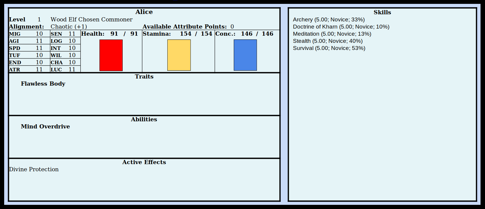

The sun had just set as you wake up, disoriented and confused. It feels like an eternity since the character creation room disappeared. *Ugh. Finally in I guess.* You look down at yourself, feeling like you're in your own body, but that body had changed. Your hands are more slender and pale than before. Or maybe it was the poor light. You check yourself, touching down your body, but all you can feel is tight leather armor going all the way down your arms and legs. *Why is it so difficult to tell what I am?* You touch your face and it feels like your face always felt. You sigh. *I gotta know.* You put a hand between your legs and push. You can barely feel your hand on your crotch due to the armor, but it's enough to tell you that not much is there. "Guess I'm a girl then." You jump at the voice and it takes a moment to realize it's your own. "Yup, definitely a girl." You smile to yourself. "Time to give myself a persona."

You look around the dark alley and find an Elven wooden bow, a quiver with arrows, two daggers, a dark gray cloak and a pouch with 100 gold inside. You're not quite sure how you know that it's exactly 100 gold, but somehow you do. *I guess that's my starting gear and guidance to what I should play.* "I'll be Robin Hood! Taking from the rich, giving to the poor! Whatever the female version of him is. Also I think I'm pretty poor." You get up, feeling a little unsteady on your feet. Your shoes are strange, very thin, as if they forgot the sole on the bottom and you're walking only on texture. It does enhance the feeling in your feet though and when you take a step you can feel the curve of the cobble stone underneath you along with the gaps between them without hurting your feet. You look up and can see a myriad of stars and patterns in the sky, very different from home. There is no moon or other planets to be seen, but then again it is not that dark yet and the 2 story buildings around you don't let you see much of the sky. The realism is remarkable. You touch the wall next to you and can actually feel it, including every single little stone of the plastering and the dirt on it that sticks to your hand and refuses to disappear despite your incessant wiping.

"Yes, this will do. This will do nicely!" you exclaim to nobody in particular as you stash the daggers, strap the quiver around you and finally cover yourself with the cloak. *This feels like Wonderland* you think, and in that moment you know your persona. "Alice, the ever wandering lost girl looking for adventure. It'll be awesome!"
In the back of your mind a menu is trying to get your attention. You don't feel like dealing with menus, you want to explore and go on an adventure, but this stupid thing keeps blinking and there doesn't seem a way to dismiss it. Reluctantly you click on it.

**Congratulations! You have reached levels 1 through 5 in Archery. (Affinity 33%)**
**Archery is the skill of using bow and arrow as well as crossbows and slings that makes hitting your mark a certainty instead of a matter of Luck.**
**You are now a Novice of Archery; you can aim slightly faster and shoot slightly further.**

"Well, that makes sense. I got a bow to start and know some archery from the get-go." You do plan on practicing just to get a feel for it, but doing it right now in this alley seems like a bad idea. You can see surprisingly well despite the poor lighting, but there is nothing to really shoot at. You'd want a target that has arrows stick and see if you can split an arrow on your second shot like the master archer you surely are. Somehow you also know what Affinity means. It feel like whenever you see a game term the game explains it to you. You don't know how exactly this works, but it's working beautifully and you don't want to rob yourself of the ability to marvel at the game doing something right. You're a little miffed though, seeing the low number. On second thought you will never become a master archer since Affinity determines how quickly you can level up a skill and it drops on every level up until you reach 0% Affinity, marking the end of your progress. Your Affinity will run out long before reaching high levels. You should probably leave making such plans until after you've seen the rest of your skills.

**Congratulations!  You have reached levels 1 through 5 in the Doctrine of Kharn. (Affinity 10%)**
**The teachings of Kharn, god of Luck, gambling and chaos. This very rare skill allows you to partially anticipate the will of Kharn. He is said to be the greatest power in the Realms, however, he acts chaotically and without a discernible plan, masking his influence. His dislike for order makes worship near impossible since any sort of ritual or scripture is akin to blasphemy.**
**You are now a Novice of the Doctrine of Kharn; outcomes you leave to chance are slightly more likely to favor you.**

You blink in disbelieve. Religion was never your strong suit and this ... this is pointless. You wonder if the devs put this in to punish players who picked the random option or if this happened by chance. Maybe you can look that up later. Either way this skill is a complete waste. You have no idea how to advance it and even if there was a way you couldn't get far anyways, seeing how your Affinity is utter trash. *Oh well, this character is just meant to give me a feel for the game, not to be awesome.* You mentally open the next message.

**Congratulations!  You have reached levels 1 through 5 in Meditation. (Affinity 13%)**
**The skill of concentrating on what matters and disregarding what doesn't. A master of Meditation is able to discern the secrets of The Realm simply by sitting down and thinking hard.**
**You are now a Novice of Meditation; meditating gives you a boost to your mental stats.**

*Okay?* You cannot imagine Robin Hood sitting down and meditating. That's probably a Friar Tuck thing to do. *Maybe the game wants me to go Monk* you muse, but don't feel like actually going in that direction. Not with a god that is impossible to worship and definitely not with 13% Affinity. You feel even less sure of this character now. Then again ... you could meditate on whether you should roll a new character. *Wouldn't that be ironic?*

**Congratulations!  You have reached levels 1 through 5 in Stealth. (Affinity 40%)**
**The art of blending in with your surroundings. Masters of stealth can vanish at any time and stay unnoticed despite being in plain sight.**
**You are now a Novice of Stealth; when spotted briefly there is a chance the observer will dismiss and forget about the encounter.**

*Now we're talking!* You played enough Skyrim to know that stealth archers are overpowered. Though maybe not in this game, but considering this and Archery are your highest skills, becoming a stealthy archer seems like a reasonable choice. And maybe your next character can be optimized for Archery if you like it. And if not, well, you could always roll up a mage after all. Maybe this is not a waste of time after all.

**Congratulations!  You have reached levels 1 through 5 in Survival. (Affinity 53%)**
**Nature is a harsh mistress, but being a skilled Survivalist allows you to thrive in it. Masters of Survival will easily avoid predators and find food and shelter in any wilderness indefinitely.**

*This is a joke, right?*

**You have earned 250 experience for advancing 5 Skills to Novice rank.**

This is your last starting skill. It's your highest Affinity, the thing you'll be the best at and ... you can't use it. You haven't scouted around, but you can tell from the smell and the buildings that you're definitely not in the wilderness. There will be no predators trying to eat you, no food lying around to find and as for shelter ... You theatrically pat the outer wall of the house next to you. *Found it! Great skill! Immediate success!*

You consider logging out and calling it early. You hadn't planned on it, but now you feel like going back to the unofficial Realm forum and leaving a 1 star review after all. You close your eyes, calming yourself down. *It's fine. I'll just look around, enjoy the graphics, talk to some NPCs and maybe do a fetch-quest and then I'll be able to make a proper character.* All the blinking prompts are gone, but now that you messed around with the interface for so long you might as well get a quick overview over your character. You concentrate on yourself and a moment later you see your character sheet.

You look through the character sheet and somehow understand what all of it means. *I didn't realize I was an Elf.* You touch your ears and they are a bit pointy indeed, but it feels like your ears have always been a little pointy. You're not sure what other differences there are between Elfs and Humans, but you know a way to find out, concentrating on the words in the character sheet.

**Elves are a proud race with a high natural life expectancy. They are tied to a forest from birth, living in synergy with and fighting alongside it against the ever expanding human civilization. On level up Elves gain 1 point each in Attractiveness and Senses along with 2 points to freely distribute.**

**Wood Elves are a subrace of Elves. They tend to be more frail and less magically inclined than other Elves, making them rely on their cunning more than their might. Wood Elves are completely in tune with nature, having a natural affinity to Archery, Stealth and Survival. Their strong connection to their forest is visible in their hair color, taking on the shade of the bark of the dominant trees there. Wood elves gain an additional point in Agility and Speed per level up.**

*So three of my skills are actually default Wood Elf skills and their high affinity just a racial bonus* you muse to yourself. *And my other two skills are random junk.* You shake your head. *I can't even blame the game for this, I chose to ignore the warning.* You do check your hair though, wondering if you'd somehow be able to identify the tree type of your home forest based on its color, but as far as you can tell your hair is simply black. You cannot think of any black trees. Maybe it's a side-effect of not actually having a connection to any forest after all since you weren't born here. Oh well, yet another wasted trait. Speaking of traits though, you do have some of those and you concentrate on them to figure out what they do.

**Flawless Body: This trait is unique across all of the Realm. Your body does not scar; instead it regenerates. Any wound you survive will eventually heal completely. Also provides a bonus to Health regeneration.**

Well, that's something. Health regeneration is not very exciting but definitely useful. Also it sort of synergizes with your Survival skill. In theory you can hide in the wilderness until you're healed, but that makes for a rather boring play-style.

**Mind Overdrive: Activated ability. While under the effect of Mind Overdrive your thinking speed is greatly increased, allowing you to plan and act unnaturally fast. Rapidly drains concentration.**

*Huh, I wonder if this will slow others or make me faster. I guess it doesn't matter. It's a single-player game, so they can all just slow down for me. Too bad this isn't my unique ability, it would be nice being the only one who can do this.*

**Divine Protection: This effect is granted while you are in your respawn area. While you are here nobody else can enter or harm you in any way.**

*Oh, so this is not me being protected by the gods, it's just the default spawn protection.* You sigh. You were really hoping for something more interesting related to what is supposed to be your Patron. *Also way to be gamey. They really should improve on the immersion aspect of the writing. Maybe just call it ... something that ties into the lore and explains why respawning is a thing here.* No matter. You feel like you got the gist of your character's stats and are ready to head out. It's finally time to play the game!